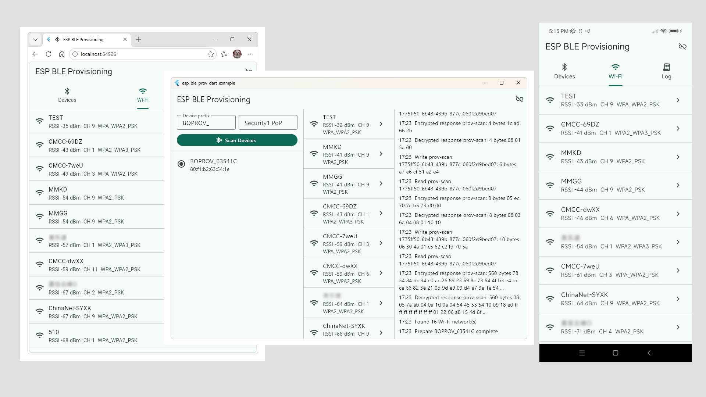

# esp_ble_prov_dart

A **pure Dart** implementation of the Espressif network provisioning protocol for Flutter.

This package is a Dart port of the open-source JavaScript implementation [`esp-ble-prov`](https://github.com/nikas-belogolov/esp-ble-prov). By rewriting the protocol logic entirely in Dart and leveraging [`universal_ble`](https://pub.dev/packages/universal_ble) for cross-platform BLE access, it eliminates any dependency on Espressif's official native SDKs.

The result is a unified, lightweight, and truly multi-platform provisioning solution without the headache of managing native bindings or platform-specific builds.

If this project saved you time, native binding headaches, or lines of code, consider buying me a coffee. Your support helps keep this project maintained, thank you!

<p align="center">
  <a href="https://ko-fi.com/oldrev">
    
  </a>
</p>


## Supported Platforms

Since it is written in pure Dart and uses `universal_ble`, this package works seamlessly across **all Flutter-supported platforms**:

* **iOS** / **macOS**
* **Android**
* **Linux**
* **Windows**
* **Web**



## Features

* **Zero Native Dependencies:** 100% pure Dart implementation of Espressif's provisioning protocol.
* **ESP BLE Provisioning over GATT:** Full control over the provisioning state machine.
* **Dynamic Endpoint Mapping:** Automatically derives built-in characteristic UUIDs; supports custom application endpoints.
* **Wi-Fi Utilities:** Scan for nearby networks, configure credentials, and apply Wi-Fi logic.
* **Protobuf-Powered:** Leverages structured ESP provisioning messages.
* **Security Support:** Fully implements `Security0` (no security) and `Security1` (Curve25519 key exchange + AES-CTR).
> *Note: `Security2` (SRP6a/AES-GCM) is currently exposed as an API placeholder and will throw a `ProvisionerError` until verification is complete.*


## Status & Architecture

This package is a Dart port of the open-source JavaScript implementation [`esp-ble-prov`](https://github.com/nikas-belogolov/esp-ble-prov)) (originally targeting Web Bluetooth).

The built-in BLE endpoint UUIDs follow ESP-IDF's default `wifi_prov_mgr` mapping:

| Endpoint | Short UUID | Description |
| --- | --- | --- |
| `prov-ctrl` | `0xFF4F` | Control session and state |
| `prov-scan` | `0xFF50` | Trigger and fetch Wi-Fi scan results |
| `prov-session` | `0xFF51` | Security handshake / session establishment |
| `prov-config` | `0xFF52` | Apply/Get Wi-Fi configurations |
| `proto-ver` | `0xFF53` | Protocol version check |

### Custom Endpoints

ESP-IDF assigns application-defined provisioning endpoints sequentially after the built-in ones (`0xFF54`, `0xFF55`, etc.). You can register them by index:

```dart
provisioner.registerCustomEndpoint('device-id'); // Index 0 -> 0xFF54
provisioner.registerCustomEndpoint('factory-info', index: 1); // Index 1 -> 0xFF55

```

## Installation

Add the package to your Flutter project:

```yaml
dependencies:
  esp_ble_prov_dart:
    path: ../ble-prov-dart # Or git/pub reference once published

```

Then run:

```bash
flutter pub get

```

### Platform Permissions

Ensure you configure the specific Bluetooth permissions required by your target operating systems (e.g., `Info.plist` for iOS/macOS, `AndroidManifest.xml` for Android). Refer to the [`universal_ble`](https://pub.dev/packages/universal_ble) documentation for setup details.

## Basic Usage

```dart
import 'package:esp_ble_prov_dart/esp_ble_prov_dart.dart';

Future<void> provisionDevice() async {
  final provisioner = EspBleProvisioner(
    deviceNamePrefix: 'PROV_',
    security: Security1(pop: 'your_proof_of_possession'),
  );

  // 1. Connect and establish an encrypted session
  await provisioner.connect();
  await provisioner.establishSession();

  // 2. Scan for Wi-Fi networks via the ESP device
  final networks = await provisioner.scan();

  // 3. Send and apply credentials
  await provisioner.sendCredentials(
    WiFiConfig(
      ssid: 'Your Wi-Fi SSID',
      passphrase: 'Your Wi-Fi Password',
      channel: networks.isNotEmpty ? networks.first.channel : 0,
    ),
  );

  await provisioner.disconnect();
}

```

## Protobuf Generation

Protocol messages live in the [`protos`](./protos) directory. If you modify or need to regenerate the Dart protobuf definitions:

```powershell
dart pub global activate protoc_plugin
.\tool\generate_protos.ps1

```

*(Generated files are output to `lib/src/proto/generated`)*

## Debugging

If you need to inspect raw encrypted/decrypted communication during development, enable payload logging:

```dart
final provisioner = EspBleProvisioner(
  deviceNamePrefix: 'PROV_',
  security: Security1(pop: 'pop'),
  logPayloads: true, // Prints hex dumps of communication to log callback
);

```

---

## License

This Flutter port is released under the **MIT License**. See [`LICENSE`](./LICENSE).

Upstream JavaScript reference project [`esp-ble-prov`](https://github.com/nikas-belogolov/esp-ble-prov) is also MIT licensed.

- Copyright © 2026 Nikas Belogolov
- Copyright © 2026 Wei Li
